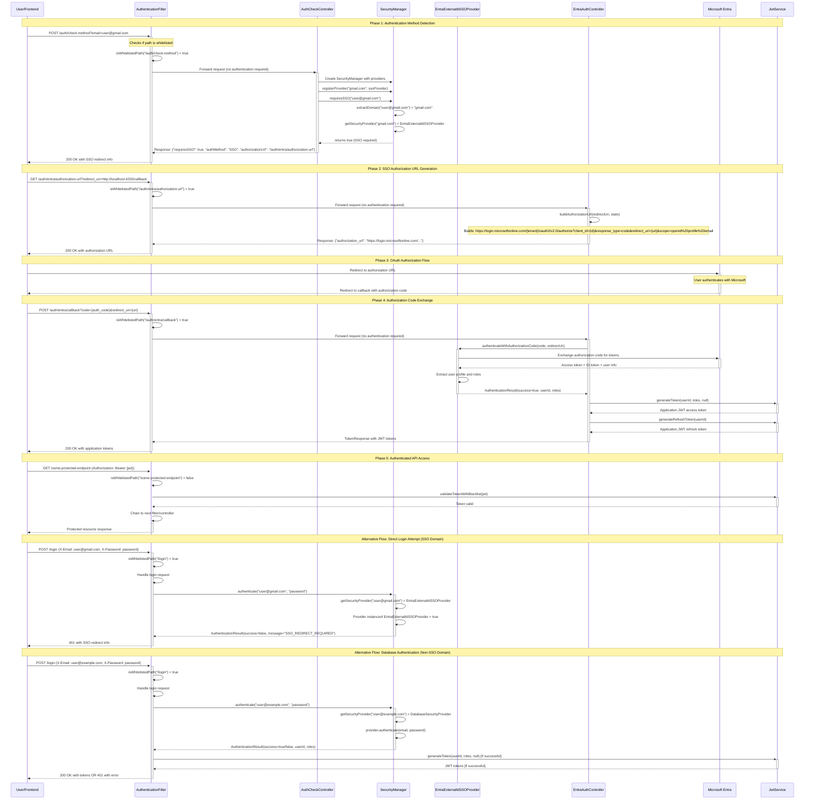

# SSO Authentication Flow Diagram

## Overview
This diagram shows the complete SSO authentication flow for the MS Entra External ID sample application.



## Key Components

### 1. AuthenticationFilter
- **Purpose**: Central filter that handles all authentication and authorization
- **Whitelist**: Allows unauthenticated access to authentication endpoints
- **JWT Validation**: Validates tokens for protected endpoints
- **SSO Detection**: Detects when SSO redirect is required

### 2. AuthCheckController
- **Endpoint**: `POST /auth/check-method`
- **Purpose**: Determines authentication method (SSO vs Password) for email domain
- **Response**: Returns `requiresSSO` flag and authorization URL if needed

### 3. EntraAuthController
- **Endpoints**: 
  - `GET /auth/entra/authorization-url` - Generates OAuth authorization URL
  - `POST /auth/entra/callback` - Handles OAuth callback with authorization code
  - `POST /auth/entra/validate` - Validates existing Entra tokens
- **Purpose**: Manages complete OAuth 2.0 / OpenID Connect flow

### 4. SecurityManager
- **Purpose**: Routes authentication requests to appropriate providers
- **Providers**: 
  - `DatabaseSecurityProvider` for password-based auth
  - `EntraExternalIdSSOProvider` for SSO domains
- **Domain Mapping**: Maps email domains to authentication providers

### 5. EntraExternalIdSSOProvider
- **Purpose**: Handles Microsoft Entra External ID authentication
- **Methods**:
  - `authenticateWithAuthorizationCode()` - Exchanges auth code for tokens
  - `validateEntraToken()` - Validates existing Entra tokens
  - `authenticate()` - Always returns failure (SSO redirect required)

## Configuration

### SSO Enabled Domains
```properties
sso.enabled-domains=gmail.com,intsof.com,microsoft.com
```

### Entra Configuration
```properties
sso.registration.azure.client-id=${SSO_REGISTRATION_AZURE_CLIENT_ID}
sso.registration.azure.tenant-id=${SSO_REGISTRATION_AZURE_TENANT_ID}
sso.registration.azure.client-secret=${SSO_REGISTRATION_AZURE_CLIENT_SECRET}
sso.registration.azure.redirect-uri=http://localhost:4200/auth/callback
sso.provider.azure.authorization-uri=https://login.microsoftonline.com/
```

### Whitelisted Endpoints (No Authentication Required)
- `/login` - Password authentication endpoint
- `/refresh` - Token refresh endpoint  
- `/logout` - Logout endpoint
- `/auth/check-method` - Authentication method detection
- `/auth/entra/authorization-url` - OAuth URL generation
- `/auth/entra/callback` - OAuth callback handler
- `/auth/entra/validate` - Token validation

## Security Features

1. **Rate Limiting**: Prevents brute force attacks on login endpoints
2. **Token Blacklisting**: Invalidates compromised tokens
3. **Token Rotation**: Generates new refresh tokens on each use
4. **Audit Logging**: Tracks all authentication events
5. **JWT Validation**: Validates tokens for protected endpoints
6. **Domain-based Routing**: Automatically routes to appropriate auth provider

## Error Handling

1. **SSO Redirect Required**: Returns 401 with redirect information
2. **Invalid Credentials**: Returns 401 with error message
3. **Missing Email**: Returns 400 with validation error
4. **Token Validation Failure**: Returns 401 with token error
5. **OAuth Errors**: Returns appropriate HTTP status with error details
